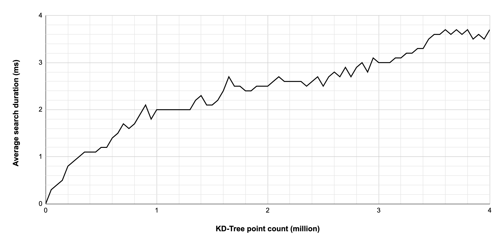

# kd-tree-cpp

_Linus Schaub, 2022_

Simple kd-tree data structure to store and find 3D points.

We use the three classes [KDTree](src/kdtree.cpp), [Axis-Aligned-Bounding-Box (AABB)](src/aabb.cpp) and [Point](src/point.cpp)


## Features

### Insertion of points

To insert a point, the insert method can be used: `insert`. It takes a pointer to a point and will add the point to the kdtree.

### Finding points

To determine if a given point is already in the kdtree, the `find_point` method can be used. It will return a pointer to the found point or a `nullptr` if no point at the same position was found.

### Nearest neighbor search

The nearest neighbor to a given point can be found with the `find_nearest` method. If no point was found (the kdtree is empty), `nullptr` will be returned. To determine the distance of a given point `p` and the found nearest point `f` can be determined with this line:

```
Point *p = new Point(2.5, 1, 10);
Point *f = kdtree.find_nearest(p);
float distance = (*p - *f).length();
```

## Usage

- `cd build`
- `cmake ..`
- `make`
- `./kdtree-cpp`

## Performance

The search performance was evaluated at different tree sizes. At each tree size, 100 points were searched and the duration was averaged. The plot below shows the average search duration by kd-tree point count.

